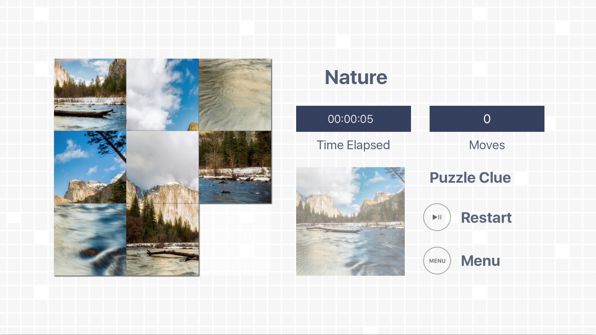

# uTilePuzzle
* My first published tvOS App. uTilePuzzle is a sliding tile puzzle to tvOS.

## Developers
* Augusto Falcão | @falcaoaugustos
* Daniel Dias | @danieldias25
* Felipe Borgez | @feliborgez

## Preview

## Showcased Skills
### Some of the skills showcased in this project are:

* Interface and Graphics Design

* Understanding of Apple's Human Interface Guidelines

## Contributing

* Do you like uTilePuzzle? Great! We could actually really use your help! Feel free to send a pull request!

## License

* uTilePuzzle is released under an MIT license. See LICENSE.md file for more information.
